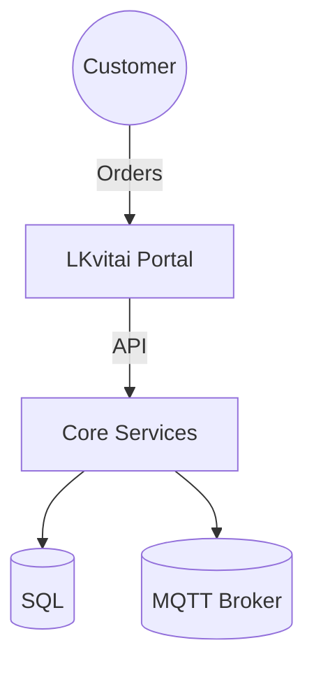

# C4: Context

## Mermaid (simple context)


## PlantUML (C4-PlantUML via Kroki)
```plantuml
@startuml
!include https://raw.githubusercontent.com/plantuml-stdlib/C4-PlantUML/master/C4_Context.puml
Person(customer, "Customer")
System(system, "LKvitai.MES", "Shopfloor & Portal")
System_Ext(agnum, "Agnum", "Accounting")
System_Ext(avea, "Avea", "Warehouse")

Rel(customer, system, "places orders")
Rel(system, agnum, "exports invoices")
Rel(system, avea, "sync stock")
@enduml
```
