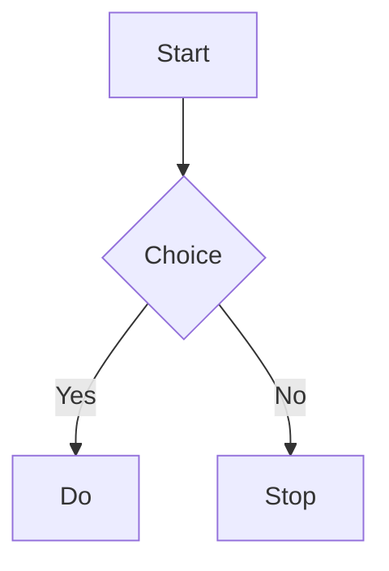

# Test

## Mermaid

```mermaid
graph TD
  A[Start] --> B{Choice}
  B -->|Yes| C[Do]
  B -->|No| D[Stop]
```

## PlantUML
```kroki-plantuml
@startuml
Alice -> Bob: Hi
@enduml
```

## PlantUML (via kroki fence)
```kroki {type=plantuml}
@startuml
Alice -> Bob: Hi (kroki)
@enduml
```

